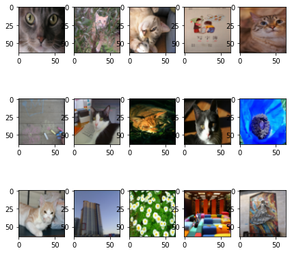
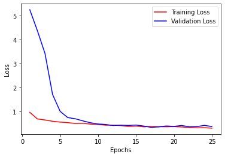
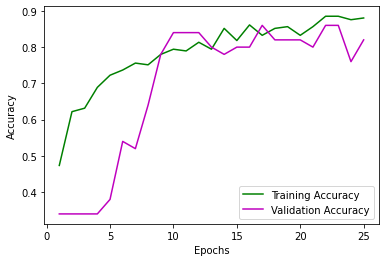
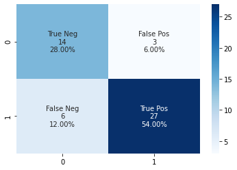

# Cat Vs Non Cat Images
This model will try to identify whether a given image is a cat or not. It uses a Convoutional Neural Network built using Keras.

The dataset used is pulled from Kaggle, which you can find [here](https://www.kaggle.com/mriganksingh/cat-images-dataset)

## Loading the dataset


```python
import h5py
import numpy as np
from matplotlib import pyplot as plt
from tensorflow import keras

train_file = h5py.File('./data/train_catvnoncat.h5', 'r')
test_file = h5py.File('./data/test_catvnoncat.h5', 'r')

print('Dataset contains these objects: ', end = '')
for key in train_file.keys():
    print(key, end = ', ')
    
# Load training data in numpy
X_train = np.array(train_file['train_set_x'][:])
y_train = np.array(train_file['train_set_y'][:])
y_train = keras.utils.to_categorical(y_train, num_classes=2)

# Load development data in numpy
X_test = np.array(test_file['test_set_x'][:])
y_test = np.array(test_file['test_set_y'][:])
y_test = keras.utils.to_categorical(y_test, num_classes=2)

# Shuffle data
train_indices = np.arange(X_train.shape[0])
test_indices = np.arange(X_test.shape[0])

np.random.shuffle(train_indices)
np.random.shuffle(test_indices)

X_train = X_train[train_indices]
y_train = y_train[train_indices]

X_test = X_test[test_indices]
y_test = y_test[test_indices]

# Plot some of the example images
print('\n\nFollowing are some images from the dataset:')
n_rows = 3
n_cols = 5
f, axarr = plt.subplots(n_rows, n_cols, figsize = (7,7))
idx = 0
for i in range(n_rows):
    for j in range(n_cols):
        axarr[i,j].imshow(X_train[idx])
        idx += 1
print('Shape of a single image:', X_train[0].shape)
print(f'We have {X_train.shape[0]} training images and {X_test.shape[0]} test images')
```

    Dataset contains these objects: list_classes, train_set_x, train_set_y, 
    
    Following are some images from the dataset:
    Shape of a single image: (64, 64, 3)
    We have 209 training images and 50 test images





## Creating the model in Keras


```python
from tensorflow import keras

model = keras.models.Sequential()

model.add(keras.layers.Conv2D(4, kernel_size = (4, 4), activation = 'relu', padding = 'same', input_shape = (64, 64, 3)))
model.add(keras.layers.MaxPool2D())
model.add(keras.layers.BatchNormalization(center=True, scale=True))
model.add(keras.layers.Dropout(0.5))
model.add(keras.layers.BatchNormalization(center=True, scale=True))
model.add(keras.layers.Conv2D(8, kernel_size = (8, 8), activation = 'relu', padding = 'same'))
model.add(keras.layers.MaxPool2D())
model.add(keras.layers.BatchNormalization(center=True, scale=True))
model.add(keras.layers.Dropout(0.5))
model.add(keras.layers.BatchNormalization(center=True, scale=True))
model.add(keras.layers.Conv2D(16, kernel_size = (8, 8), activation = 'relu', padding = 'same'))
model.add(keras.layers.MaxPool2D())
model.add(keras.layers.BatchNormalization(center=True, scale=True))
model.add(keras.layers.Dropout(0.5))
model.add(keras.layers.BatchNormalization(center=True, scale=True))
model.add(keras.layers.Flatten())
model.add(keras.layers.Dense(64, activation='relu'))
model.add(keras.layers.BatchNormalization(center=True, scale=True))
model.add(keras.layers.Dense(8, activation='relu'))
model.add(keras.layers.BatchNormalization(center=True, scale=True))
model.add(keras.layers.Dense(units=2, activation='softmax'))

model.compile(loss = 'categorical_crossentropy',
             optimizer = 'adam',
             metrics = ['accuracy'])
model.summary()
```

    Model: "sequential"
    _________________________________________________________________
    Layer (type)                 Output Shape              Param #   
    =================================================================
    conv2d (Conv2D)              (None, 64, 64, 4)         196       
    _________________________________________________________________
    max_pooling2d (MaxPooling2D) (None, 32, 32, 4)         0         
    _________________________________________________________________
    batch_normalization (BatchNo (None, 32, 32, 4)         16        
    _________________________________________________________________
    dropout (Dropout)            (None, 32, 32, 4)         0         
    _________________________________________________________________
    batch_normalization_1 (Batch (None, 32, 32, 4)         16        
    _________________________________________________________________
    conv2d_1 (Conv2D)            (None, 32, 32, 8)         2056      
    _________________________________________________________________
    max_pooling2d_1 (MaxPooling2 (None, 16, 16, 8)         0         
    _________________________________________________________________
    batch_normalization_2 (Batch (None, 16, 16, 8)         32        
    _________________________________________________________________
    dropout_1 (Dropout)          (None, 16, 16, 8)         0         
    _________________________________________________________________
    batch_normalization_3 (Batch (None, 16, 16, 8)         32        
    _________________________________________________________________
    conv2d_2 (Conv2D)            (None, 16, 16, 16)        8208      
    _________________________________________________________________
    max_pooling2d_2 (MaxPooling2 (None, 8, 8, 16)          0         
    _________________________________________________________________
    batch_normalization_4 (Batch (None, 8, 8, 16)          64        
    _________________________________________________________________
    dropout_2 (Dropout)          (None, 8, 8, 16)          0         
    _________________________________________________________________
    batch_normalization_5 (Batch (None, 8, 8, 16)          64        
    _________________________________________________________________
    flatten (Flatten)            (None, 1024)              0         
    _________________________________________________________________
    dense (Dense)                (None, 64)                65600     
    _________________________________________________________________
    batch_normalization_6 (Batch (None, 64)                256       
    _________________________________________________________________
    dense_1 (Dense)              (None, 8)                 520       
    _________________________________________________________________
    batch_normalization_7 (Batch (None, 8)                 32        
    _________________________________________________________________
    dense_2 (Dense)              (None, 2)                 18        
    =================================================================
    Total params: 77,110
    Trainable params: 76,854
    Non-trainable params: 256
    _________________________________________________________________


## Training the model


```python
#Set epochs
epochs = 25

#Clear output
import IPython
import time
class ClearTrainingOutput(keras.callbacks.Callback):
  def on_train_end(*args, **kwargs):
    IPython.display.clear_output()
    
#Fit the model
start_time = time.time()
trained_model = model.fit(X_train, y_train, epochs = epochs, validation_data = (X_test, y_test), callbacks = [ClearTrainingOutput()])
end_time = time.time()
print(f'That took {end_time - start_time:.2f} seconds')
```

    That took 28.14 seconds


```python
# Print the learning curve
plt.plot(range(1, epochs+1), trained_model.history['loss'] , 'r', range(1, epochs+1), trained_model.history['val_loss'], 'b')
plt.xlabel('Epochs')
plt.ylabel('Loss')
_ = plt.legend(['Training Loss', 'Validation Loss'])
```





```python
# Print the Accuracy curve
plt.plot(range(1, epochs+1), trained_model.history['accuracy'] , 'g', range(1, epochs+1), trained_model.history['val_accuracy'], 'm')
plt.xlabel('Epochs')
plt.ylabel('Accuracy')
plt.legend(['Training Accuracy', 'Validation Accuracy'])
print('Max Accuracy Reached: {0:0.2f} %'.format((max(trained_model.history['val_accuracy']) * 100)) )
```

    Max Accuracy Reached: 86.00 %





## Final discussions
The model here is pretty simple. I handpicked the hyperparameters that seemed to work best. There is scope for further improvement in this model. However, with only 209 examples in our training and 50 images in our development set, this was the best the model could do without overfitting the data in my opinion.

### Let's look at the confusion matrix of the model


```python
from sklearn.metrics import confusion_matrix
import seaborn as sns

# We do not have test data so let's look at the confusion matrix of the development data
y_test_pred = model.predict(X_test)
y_test_pred = np.argmax(y_test_pred, axis = 1)
cf_matrix = confusion_matrix(np.argmax(y_test, axis = 1), y_test_pred)

# Code taken from https://medium.com/@dtuk81/confusion-matrix-visualization-fc31e3f30fea
# Courtesy of T. Dennis to make this useful piece for visualization using confusion matrix
group_names = ['True Neg','False Pos','False Neg','True Pos']
group_counts = ['{0:0.0f}'.format(value) for value in cf_matrix.flatten()]
group_percentages = ['{0:.2%}'.format(value) for value in cf_matrix.flatten()/np.sum(cf_matrix)]
labels = [f'{v1}\n{v2}\n{v3}' for v1, v2, v3 in zip(group_names,group_counts,group_percentages)]
labels = np.asarray(labels).reshape(2,2)
_ = sns.heatmap(cf_matrix, annot=labels, fmt='', cmap='Blues')
```




